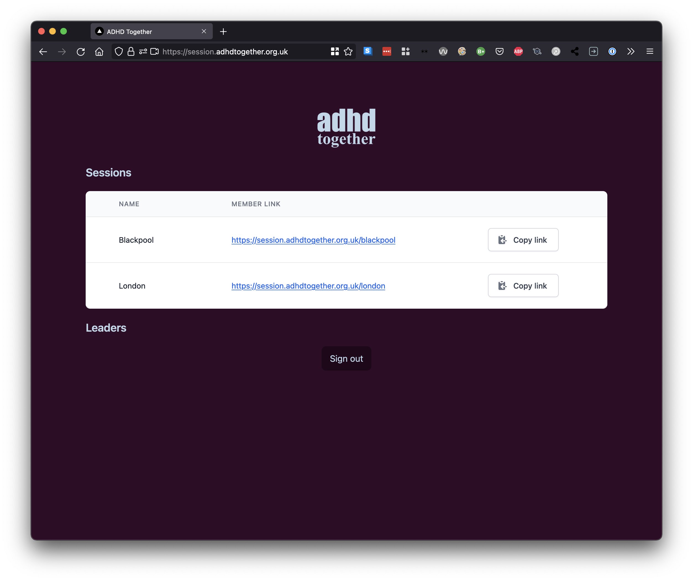

This is a [Next.js](https://nextjs.org/) project bootstrapped with [`create-next-app`](https://github.com/vercel/next.js/tree/canary/packages/create-next-app).

## Screenshots

### Session call (leader view)


### Rooms directory


### Magic link sign-in


## Getting Started

First, copy the `.env.template` file to `.env.local`, and fill in the gaps.

Then, run the development server:

```bash
npm run dev
# or
yarn dev
```

Open [http://localhost:3000](http://localhost:3000) with your browser to see the result.

You can start editing the page by modifying `pages/index.tsx`. The page auto-updates as you edit the file.

[API routes](https://nextjs.org/docs/api-routes/introduction) can be accessed on [http://localhost:3000/api/hello](http://localhost:3000/api/hello). This endpoint can be edited in `pages/api/hello.ts`.

The `pages/api` directory is mapped to `/api/*`. Files in this directory are treated as [API routes](https://nextjs.org/docs/api-routes/introduction) instead of React pages.

## Technical stack

- [React](https://reactjs.org/docs/getting-started.html/) - UI rendering
- [Tailwind](https://tailwindcss.com/docs) - Styling
- [Next](https://nextjs.org/docs) - App server
- [Supabase](https://supabase.io/docs) - Database layer